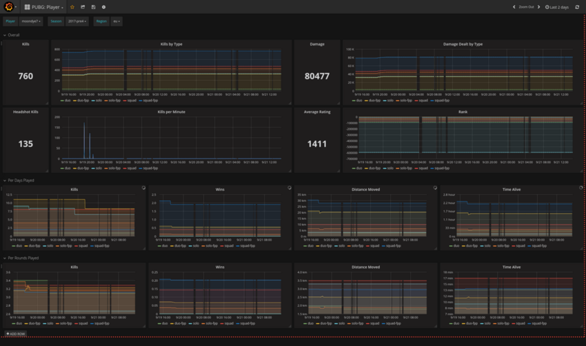
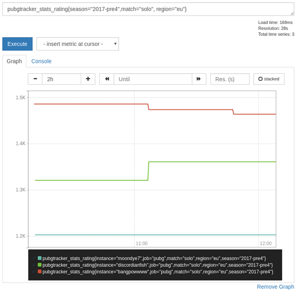
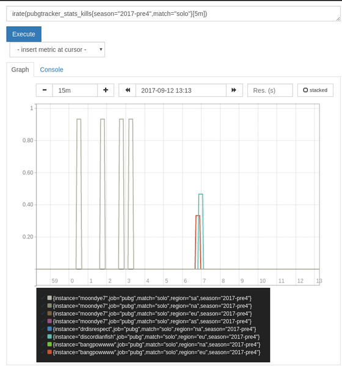

# Pubgtracker Exporter
**DEPRECATED - DOESN'T WORK ANYMORE DUE TO API CHANGES AND NO PLANS TO UPDATE**
[](grafana/pubg-player.png)

[Prometheus](https://prometheus.io) Exporter exposing
[pubtracker](https://pubgtracker.com) stats.



PUBGTracker provides gaming stats for the [PLAYERUNKNOWN'S
BATTLEGROUND](https://www.playbattlegrounds.com).

The exporter exposes the raw stats from the pubgtracker API, therefor the
metrics are untyped and do not follow the Prometheus best practices.

## Dashboard
You can find a ready to use dashboard in [grafana/](grafana/) or get it from
Grafana Labs: https://grafana.com/dashboards/3287

## Examples
The examples use this scrape config for nicer labels and configuration:

```
- job_name: 'pubg'
  static_configs:
    - targets:
      - discordianfish
      - bangpowwww
      - drdisrespect
      - shroud
      - moondye7
  relabel_configs:
    - target_label: __metrics_path__
      source_labels: [__address__]
      replacement: /metrics/${1}
    - target_label: instance
      source_labels: [__address__]
    - target_label: __address__
      replacement: 127.0.0.1:9001
```

Where under targets we list the players we're interested in.

### "kill rate"


### Calculate average kills per minute across all seasons
```
avg by (instance) ((pubgtracker_stats_kills/pubgtracker_stats_time_survived) * 60)

{instance="shroud"} 0.24515264442634924
{instance="drdisrespect"} 0.17125793695285624
{instance="moondye7"} 0.1913623025488996
{instance="bangpowwww"} 0.04702200358885065
{instance="discordianfish"} 0.0662140377518949
```

### Average kills per day played
```
avg by (instance) ((pubgtracker_stats_kills/pubgtracker_stats_days))

{instance="moondye7"} 7.064513179239221
{instance="drdisrespect"} 8.723919380353863
{instance="discordianfish"} 3.5027568922305767
{instance="shroud"} 20.597288676236047
{instance="bangpowwww"} 2.525
```


## Usage
```
$ ./pubgtracker_exporter &
$ curl -s localhost:8080/metrics/discordianfish | grep -i pubgtracker_stats_longest_kill
# HELP pubgtracker_stats_longest_kill Longest Kill
# TYPE pubgtracker_stats_longest_kill untyped
pubgtracker_stats_longest_kill{match="duo",region="eu",season="2017-pre2"}
342.54
pubgtracker_stats_longest_kill{match="duo",region="eu",season="2017-pre4"}
184.39
pubgtracker_stats_longest_kill{match="solo",region="eu",season="2017-pre2"}
219.08
pubgtracker_stats_longest_kill{match="solo",region="eu",season="2017-pre4"}
190.7
pubgtracker_stats_longest_kill{match="squad",region="eu",season="2017-pre2"}
367.31
pubgtracker_stats_longest_kill{match="squad",region="eu",season="2017-pre4"}
1.41
```
